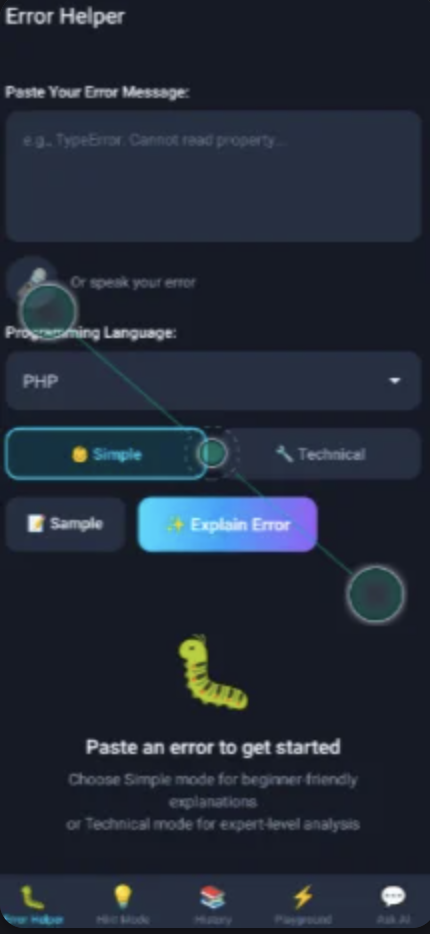
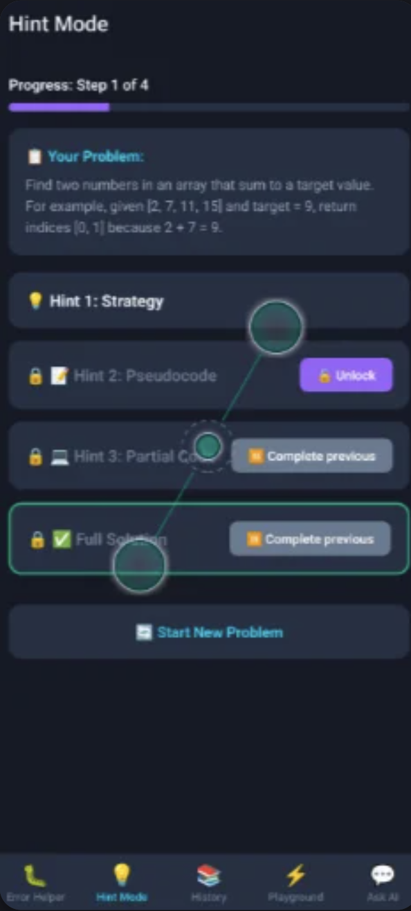
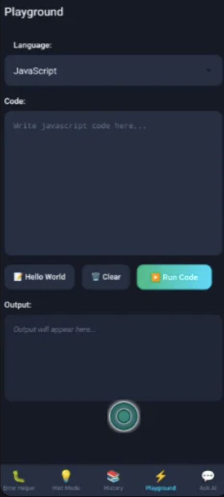
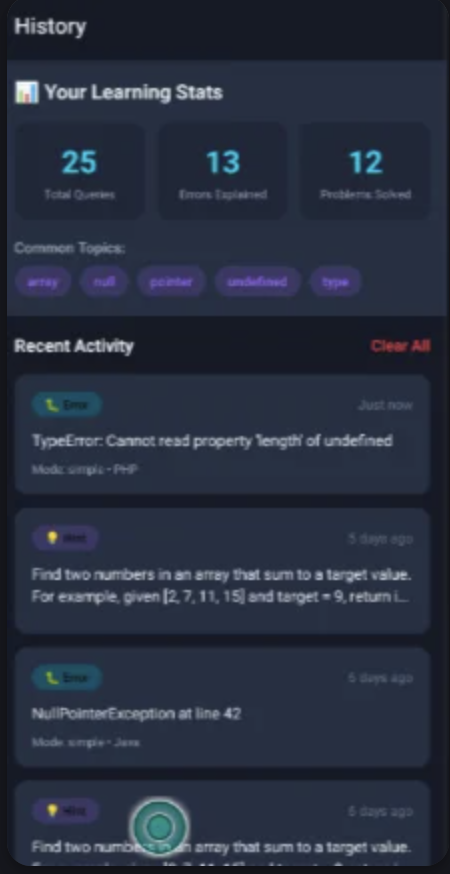
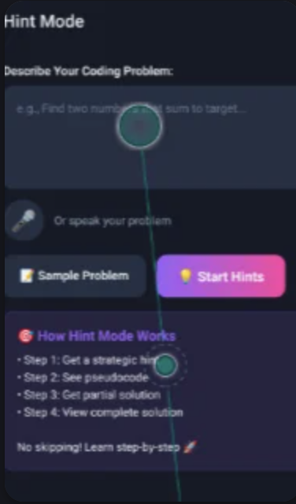

# Code Learning Assistant

**An offline AI coding tutor that teaches you to think, not just copy answers.**

Code Learning Assistant is a React Native app that helps beginners understand errors, solve problems step by step, and practise code on their phone. The AI model runs entirely on the device. After a one-time model download, the app needs no internet, costs nothing per question, and never sends your code anywhere.

Built by **Team Bug Slayers** for **Horizon by Hoollow**, theme *AI with Education*.

<p align="center">
  
  
  
  
</p>

---

## The problem

- **Errors are hard to read.** A message like `TypeError: Cannot read property 'length' of undefined` means nothing to a beginner.
- **AI chatbots give away the answer.** Students copy the full solution and learn nothing about how to solve the problem.
- **Cloud AI isn't available to everyone.** It needs a stable connection and paid APIs, and it sends your code to a server.
- **Many students learn on a phone.** Most coding tools are built for laptops.

## Our approach

A good teacher doesn't give you the answer. They give you the next hint. Every feature in the app is built around that idea.

---

## Features

### 🐛 Error Helper


- Paste an error, or say it out loud with voice input
- Pick the language: JavaScript, Python, Java, C++, C#, Go, Rust, SQL, PHP
- **Simple mode** gives a beginner-friendly explanation; **Technical mode** gives a deeper root-cause analysis
- Listen to the explanation with text-to-speech
- Every explanation is saved to your learning history

<br clear="right" />

### 💡 Hint Mode: learn step by step

<p>
  
  
</p>

Describe a coding problem (typed or spoken), and the AI helps in four locked steps:

1. **Strategy:** which approach to think about
2. **Pseudocode:** the logic in plain steps
3. **Partial code:** a skeleton for you to finish
4. **Full solution:** unlocked only after steps 1–3

You can't skip ahead, so you have to think at each step. The final code opens straight in the Playground with **Try This Code**.

### ⚡ Code Playground


- Write and run **JavaScript** on the phone in a sandboxed engine
- Output console with execution time and clear error display
- Starter templates such as Hello World

<br clear="right" />

### 💬 Ask AI


- Chat about any coding question, typed or spoken
- Carries context over from Error Helper and Hint Mode
- Detects code blocks in replies and highlights the syntax

<br clear="right" />

### 📚 Learning History


- Stats: total questions, errors explained, problems solved
- **Common topics** (such as `null`, `undefined`, arrays) show what to practise next
- Tap any past item to review it; delete items or clear all
- Stored only on your phone

<br clear="right" />

---

## Why on-device AI

| | Typical AI chatbot | Code Learning Assistant |
|---|---|---|
| Internet | Always required | Only once, to download the model |
| Cost per question | Paid API or subscription | ₹0 |
| Your code | Sent to a cloud server | Never leaves the device |
| Teaching style | Gives the full answer | Hints in 4 locked steps |
| Explanation level | One size fits all | Simple or Technical |

## How it works

```
Text or voice input
   │   (voice → Whisper speech-to-text, on device)
   ▼
Prompt builder  ── Simple / Technical / hint-step prompts
   ▼
On-device LLM   ── LiquidAI LFM2-350M (Q8) on llama.cpp, via RunAnywhere SDK
   ▼
Response parser ── detects code blocks, highlights syntax
   ▼
UI  ·  Text-to-speech (Piper)  ·  Code Playground
   │
   └─ Local storage (AsyncStorage): history, stats, chat context
```

| Model | Purpose |
|---|---|
| `lfm2-350m-q8_0` | Language model for explanations, hints and chat |
| `sherpa-onnx-whisper-tiny.en` | Speech-to-text |
| `vits-piper-en_US-lessac-medium` | Text-to-speech |

Models are downloaded once, from inside the app, the first time you use each feature. After that, everything runs offline.

## Tech stack

- React Native 0.83 (TypeScript)
- [RunAnywhere SDK](https://www.npmjs.com/org/runanywhere): `@runanywhere/core`, `@runanywhere/llamacpp`, `@runanywhere/onnx`
- React Navigation (stack and bottom tabs)
- AsyncStorage for local history
- `react-native-live-audio-stream` for voice input, `react-native-sound` for playback
- `react-native-syntax-highlighter` for code blocks

## Project structure

```
src/
├── screens/        ErrorExplainerScreen, HintModeScreen, CodePlaygroundScreen,
│                   SmartChatScreen, LearningHistoryScreen
├── components/     CodeBlock, FormattedResponse, VoiceButton, SpeakerButton, ModelLoaderWidget
├── hooks/          useErrorExplainer, useHintMode, useConversation, useHistory,
│                   useVoiceInput, useTextToSpeech
├── services/       ModelService (model download and loading), ExecutionEngine (code sandbox)
├── utils/          prompts, codeParser, codeSamples, storage
└── navigation/     LearningNavigator (bottom tabs)
```

---

## Run it locally (Android)

**Prerequisites:** Node.js 18+, JDK 17, Android Studio with Android SDK 36 and NDK `29.0.14206865`. A physical device is recommended, because the AI model runs slowly on emulators.

```bash
git clone https://github.com/ananya24s/code_learning_assistant.git
cd code_learning_assistant
npm install
npx react-native start
```

In a second terminal:

```bash
npx react-native run-android
```

On first launch, open **Learning** and tap the button to download the AI model. This needs internet once. After that, the app works offline.

## Roadmap

- Hindi and regional-language voice explanations
- More languages in the Playground (Python, C++, Java)
- Practice quizzes built from each learner's weak topics
- Hint difficulty that adapts to the learner's level
- Teacher dashboard and offline content packs for classrooms

## Team Bug Slayers

- Ananya Singh
- Madhavi Singh
- Navya Bansal
- Naman Talwar

## Acknowledgements

This app is built on the [RunAnywhere SDK](https://www.npmjs.com/org/runanywhere) and started from its [React Native starter app](https://github.com/RunanywhereAI/react-native-starter-app), which provided the SDK setup, model loading and voice plumbing. The learning features (Error Helper, Hint Mode, Code Playground, Ask AI and Learning History) are our own work.
